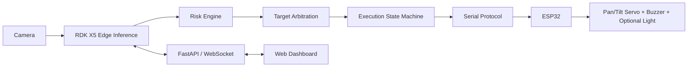

# ARGUS for RDK X5

[中文完整说明](README_CN.md)

ARGUS is a public research prototype for fixed-camera, PPE-aware safety
observation and directional warning on the D-Robotics RDK X5. It combines
three-class YOLO detection, lightweight tracking, temporal risk reasoning,
multi-target arbitration, an execution state machine, and an ESP32 serial
controller.

> ARGUS is a research and engineering prototype. It does not replace a
> certified industrial safety system, emergency stop, mechanical limit,
> guarding, or trained human supervision.

## Data flow



The intervention path is more than “make a servo follow a detection box”.
ARGUS associates helmet and vest detections with people, smooths PPE state
across frames, evaluates zone rules and duration, ranks competing targets,
applies target-lock hysteresis, and only then emits an actuator command.

## Repository layout

```text
online/       network-accessible dashboard mode
offline/      local-preview mode
firmware/     ESP32 Arduino firmware
configs/      safe examples and the RDK X5 model profile
models/       model contract, manifest, and placement guide
docs/         deployment, wiring, protocol, calibration, and safety guides
tests/        hardware-free core checks
```

## Quick start

1. Copy the safe example:

   ```bash
   cp configs/runtime.example.yaml configs/runtime.yaml
   ```

2. Obtain a compatible Bayes-E model and place it at:

   ```text
   models/argus_ppe_dfl_640_rdkx5.bin
   ```

3. On an RDK X5 with its BPU runtime installed:

   ```bash
   python3 -m pip install -r requirements.txt
   ./online/check_system.sh
   ./online/start.sh
   ```

4. Open `http://127.0.0.1:8000`. To access it from another trusted host,
   explicitly set `host` in `configs/runtime.yaml`.

Hardware, servo, buzzer, optional light, and LLM integrations are disabled by
default. Read [the Chinese guide](README_CN.md) and
[the deployment guide](docs/DEPLOYMENT_RDK_X5.md) before enabling them.

## Model contract

- input: `1×3×640×640`, NV12 at RDK runtime;
- classes: `person`, `helmet`, `reflective_vest`;
- strides: `8`, `16`, `32`;
- DFL `reg_max`: `16`;
- outputs: six tensors, classification `[0,2,4]`, regression `[1,3,5]`;
- post-processing: sigmoid, DFL softmax, `dist2bbox`, class-aware NMS.

Model binaries are intentionally excluded from Git and from this release
because the discovered files contain embedded build/training-machine paths and
their dataset redistribution rights could not be verified. See
[models/README.md](models/README.md).

## License

Repository code and documentation are released under the [MIT License](LICENSE).
Model files and third-party runtimes retain their own licenses.
