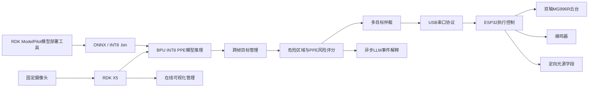

# 嵌赛地瓜机器人RDK X5赛道仓库

基于RDKX5的自训练模型可视化主动安全干预系统与双模低载LLM推理

[English README](README_EN.md) | [历史中文说明](README_CN.md) | [ModelPilot 工具](tools/rdk-modelpilot/README.md)

> 本项目是嵌入式芯片与系统设计竞赛地瓜机器人 RDK X5 赛道的竞赛原型。它用于展示边缘视觉、风险判断、执行端控制和模型部署流程，不替代经过认证的工业安全系统、急停装置、防护栏、安全联锁或人工监管。

## 作品名称

基于RDKX5的自训练模型可视化主动安全干预系统与双模低载LLM推理

## 项目简介

本仓库面向实验室、施工区域和设备作业空间中的主动安全提醒场景。系统使用固定摄像头采集现场画面，在 RDK X5 上部署自训练 PPE 检测模型，识别 `person`、`helmet`、`reflective_vest` 三类目标，并结合危险区域规则、PPE 状态、停留时间、运动趋势和检测可信度进行风险判断。

当风险满足触发条件后，RDK X5 通过 USB 串口向 ESP32 下发控制指令，由 ESP32 驱动双轴 MG996R 云台、蜂鸣器和定向光源字段进行现场提示。在线模式提供 Web 可视化、事件日志和异步 LLM 事件解释；离线模式保留本地自治运行链路，便于板端调试和低负载运行。

本仓库同时合并了配套 Windows 工具 **RDK ModelPilot**，位置为 `tools/rdk-modelpilot/`。它用于完成模型转换环境检测、`.pt → ONNX → RDK X5 Bayes-E INT8 .bin` 转换、ONNX 六输出 DFL 结构检查、校准集质量检查和部署报告生成。原独立仓库 [AIM135D/rdk-modelpilot](https://github.com/AIM135D/rdk-modelpilot) 仍保留，本仓库只是为了比赛提交把源码同步进主项目。

## 仓库内容

- `online/`：RDK X5 在线运行模式，包含 FastAPI、WebSocket、Web 页面、BPU 推理、风险判断、目标仲裁和串口控制。
- `offline/`：RDK X5 离线运行模式，保留本地预览和自治运行路径。
- `firmware/`：ESP32 执行端固件，用于解析串口协议并控制舵机、蜂鸣器和预留灯光字段。
- `configs/`：运行配置、安全默认值、危险区域示例、舵机标定示例和模型配置。
- `models/`：模型放置说明、模型卡和 Release 模型清单。
- `docs/`：部署、硬件接线、串口协议、标定、模型流程、主动学习和安全限制文档。
- `tools/rdk-modelpilot/`：Windows 端 RDK ModelPilot 模型部署工具。
- `tests/`：不依赖硬件的基础逻辑检查。

## 系统核心流程



整体链路为：

```text
数据训练与模型部署
→ RDK X5 边缘推理
→ PPE 与危险区域规则判断
→ 风险评分与多目标仲裁
→ ESP32 执行端控制
→ Web 可视化、日志记录与异步 LLM 解释
```

## 主要功能

1. 自训练 PPE 检测模型
   - 类别为 `person`、`helmet`、`reflective_vest`。
   - 面向固定广角摄像头视角和实际部署距离做数据补充。
   - 训练、主动学习和标定补充见 [TRAINING_ACTIVE_LEARNING_AND_MAPPING.md](docs/TRAINING_ACTIVE_LEARNING_AND_MAPPING.md)。

2. RDK X5 BPU 部署
   - 输入尺寸 640×640。
   - RDK 运行时输入格式为 NV12。
   - YOLO DFL 六输出后处理。
   - 默认部署模型为 Bayes-E INT8 `.bin`。

3. 多危险区域管理
   - 支持危险区域配置、风险等级、安全帽要求、反光衣要求和独立启停。
   - 区域配置示例见 `configs/danger_zones.example.json`。

4. 风险判断与目标仲裁
   - 对 PPE 合规、停留时间、运动趋势、检测置信度和区域风险进行综合评分。
   - 多人同时出现时，使用目标锁定、切换代价和抢占阈值减少执行端频繁跳变。
   - 短时丢失时保留状态，避免单帧漏检导致控制抖动。

5. 主动干预执行
   - ESP32 控制双轴 MG996R 云台、蜂鸣器和预留灯光字段。
   - RDK X5 端默认使用 `A` 协议发送 pan/tilt 角度。
   - ESP32 返回 ACK，Web 页面显示串口状态、最后指令和最后 ACK。

6. 在线与离线模式
   - 在线模式提供浏览器管理界面、实时画面、危险区域、运行状态、事件日志和 LLM 建议。
   - 离线模式用于本地自治调试，不依赖云端服务或浏览器持续连接。
   - 两种模式的硬件输出默认关闭，确认现场接线和限位后再启用。

7. 双模低载 LLM 推理
   - LLM 只参与事件摘要和处置建议，不阻塞实时检测与执行链路。
   - `llm_bridge_enabled` 默认关闭，缺少 ROS 2 或 LLM 运行环境时系统会降级为普通事件日志。
   - 在线模式展示 LLM 建议；离线模式保留同一套异步桥接代码，便于板端低负载调试。

8. RDK ModelPilot
   - Windows / WSL / Conda / Docker / OpenExplorer 环境检测。
   - 依赖安装和修复脚本生成。
   - 拖入 `.pt` 模型、`data.yaml` 和校准图片文件夹。
   - 调用 D-Robotics `rdk_model_zoo` 官方 `export_monkey_patch.py` 导出 ONNX。
   - 检查 ONNX 是否为 RDK X5 六输出 DFL 结构。
   - 调用 OpenExplorer Docker、`hb_mapper` 或 `mapper.py` 生成 INT8 `.bin`。
   - 生成 `deploy_config.py` 和 `deploy_report.md`。

## 目录结构

```text
.
├── .github/                         # GitHub 工作流和仓库配置
├── configs/                         # 运行配置、模型配置、区域和标定示例
├── docs/                            # 部署、接线、协议、标定、模型和安全文档
├── firmware/esp32/                  # ESP32 执行端固件
├── models/                          # 模型说明、模型卡和 Release 清单
├── offline/                         # RDK X5 离线模式
├── online/                          # RDK X5 在线模式
├── scripts/                         # 辅助脚本
├── tests/                           # 不依赖硬件的基础检查
├── tools/rdk-modelpilot/            # Windows 模型部署工具
├── requirements.txt                 # RDK X5 Python 依赖
├── README.md                        # 中文总说明
├── README_EN.md                     # English README
└── README_CN.md                     # 早期中文详细说明，保留作为补充
```

## 文档索引

- [系统总览](docs/system_overview.md)
- [RDK X5 部署](docs/DEPLOYMENT_RDK_X5.md)
- [模型转换与后处理](docs/MODEL_PIPELINE.md)
- [训练、主动学习与映射说明](docs/TRAINING_ACTIVE_LEARNING_AND_MAPPING.md)
- [RDK ModelPilot 集成说明](docs/modelpilot_integration.md)
- [硬件接线](docs/HARDWARE_AND_WIRING.md)
- [串口协议](docs/SERIAL_PROTOCOL.md)
- [标定说明](docs/CALIBRATION.md)
- [安全与限制](docs/SAFETY_AND_LIMITATIONS.md)

## 硬件组成

- RDK X5。
- 固定广角摄像头或 USB 摄像头。
- ESP32-E / ESP-WROOM-32E 开发板。
- MG996R 舵机 × 2。
- 蜂鸣器。
- 定向光源或预留灯光执行端。
- 自设 PCB 或等效转接电路。
- 12V 电源适配器。
- 舵机独立 6V 供电。
- RDK X5 与 ESP32 通过 USB 串口通信。
- 各模块必须共地。

硬件供电、舵机电流、接线方式和机械限位需要根据现场设备调整。首次运行前建议保持 `hardware_enabled: false`，先确认摄像头、模型和 Web 页面，再单独测试 ESP32 和舵机。

## 模型说明

类别顺序：

```text
0 person
1 helmet
2 reflective_vest
```

模型契约：

- 输入尺寸：640×640。
- 运行时输入：NV12。
- 检测头：六输出 DFL。
- stride：8、16、32。
- DFL `reg_max`：16。
- 分类输出：`[0, 2, 4]`。
- 回归输出：`[1, 3, 5]`。
- 后处理：sigmoid、DFL softmax、dist2bbox、类别 NMS、PPE 与 person 关联。

默认模型路径：

```text
models/argus_ppe_dfl_640_rdkx5.bin
```

模型文件不进入 Git 历史。经项目所有者授权，匹配当前接口的 `.pt`、`.onnx` 和 Bayes-E `.bin` 已作为 [v1.0.0 Release](https://github.com/AIM135D/argus-rdk-x5/releases/tag/v1.0.0) 附件发布。文件名和校验值见 [models/README.md](models/README.md) 与 [models/model_manifest.json](models/model_manifest.json)。

## RDK X5 板端环境

板端环境需要根据实际系统镜像确认，当前代码主要依赖：

- Ubuntu 22.04 或 RDK X5 官方系统环境。
- Python 3。
- RDK X5 BPU Runtime。
- `hobot_dnn` / `pyeasy_dnn`。
- `hrt_model_exec`。
- OpenCV。
- NumPy。
- SciPy。
- FastAPI。
- Uvicorn / WebSocket。
- PyYAML。
- pyserial。

安装 Python 依赖：

```bash
python3 -m pip install -r requirements.txt
```

`hobot_dnn`、`pyeasy_dnn`、BPU Runtime 和 `hrt_model_exec` 通常来自 RDK X5 系统镜像或 D-Robotics 工具链，不应简单用普通 PyPI 包替代。

## 快速运行

准备配置：

```bash
cp configs/runtime.example.yaml configs/runtime.yaml
cp configs/danger_zones.example.json configs/danger_zones.runtime.json
cp configs/servo_calibration.example.json configs/servo_calibration.runtime.json
```

安装依赖并做基础检查：

```bash
python3 -m pip install -r requirements.txt
./online/check_system.sh
```

如需启用 ESP32，确认串口权限：

```bash
chmod 666 /dev/ttyUSB0
```

启动在线模式：

```bash
./online/start.sh
```

默认访问：

```text
http://127.0.0.1:8000
```

如果要从局域网其他设备访问，需要在 `configs/runtime.yaml` 中把 `host` 从 `127.0.0.1` 改为受信任网络下的板卡地址或 `0.0.0.0`。摄像头设备号、模型路径、串口号和 Web 端口都应按现场环境调整。

## 在线模式

在线模式位于 `online/`，适合展示和调试：

- 实时画面与检测结果。
- 危险区域和 PPE 状态。
- 风险评分、目标仲裁和执行状态。
- ESP32 串口状态、最后指令和 ACK。
- 性能信息和事件日志。
- 异步 LLM 建议。

核心安全链路不依赖浏览器持续打开。浏览器页面主要用于配置、观察和记录。

## 离线模式

离线模式位于 `offline/`，用于本地自治运行和板端调试：

```bash
./offline/start.sh
```

它保留图像采集、BPU 推理、风险判断、目标仲裁和 ESP32 执行控制。离线模式适合在没有远程浏览器或网络不稳定的情况下做基础验证。

## ESP32 固件

固件位置：

```text
firmware/esp32/active_warning_controller/active_warning_controller.ino
```

可使用 Arduino IDE 或 PlatformIO 烧录。当前公开固件验证过的默认引脚为：

- 水平舵机：GPIO25。
- 俯仰舵机：GPIO26。
- 蜂鸣器：GPIO27。

RDK X5 端默认串口为 `/dev/ttyUSB0`，波特率 `115200`，协议为 `A`。烧录前需要检查舵机 GPIO、蜂鸣器 GPIO、灯光 GPIO、串口波特率和 RDK 配置是否一致。详细协议见 [docs/SERIAL_PROTOCOL.md](docs/SERIAL_PROTOCOL.md)。

## RDK ModelPilot 工具

RDK ModelPilot 位于：

```text
tools/rdk-modelpilot/
```

它是配套 Windows 端模型部署工具，不替代 RDK Studio，也不负责板卡烧录、通用 IDE、训练平台或数据标注。它主要解决自训练 YOLO 模型迁移到 RDK X5 时的工程步骤：环境检查、官方导出脚本调用、ONNX 结构检查、OpenExplorer 量化编译和部署报告生成。

Windows 安装包和便携版下载：

```text
https://github.com/AIM135D/rdk-modelpilot/releases/tag/v0.1.0
```

主仓库保留的是源码副本，便于比赛提交和代码审查；安装器仍通过独立软件仓库 Release 发布。

启动后端：

```powershell
cd tools\rdk-modelpilot
python -m pip install -r backend\requirements.txt
python backend\main.py
```

启动前端：

```powershell
cd tools\rdk-modelpilot
npm --prefix frontend install
npm --prefix frontend run electron:dev
```

构建前端：

```powershell
npm --prefix frontend run build
```

更多说明见 [tools/rdk-modelpilot/README.md](tools/rdk-modelpilot/README.md) 和 [docs/modelpilot_integration.md](docs/modelpilot_integration.md)。

## 模型转换建议

如果只运行现有系统，可以直接使用 Release 中的 RDK X5 `.bin` 模型。如果需要替换新模型，建议使用 `tools/rdk-modelpilot/` 或 D-Robotics `rdk_model_zoo` 官方流程：

```text
.pt
→ export_monkey_patch.py
→ ONNX
→ hb_mapper checker
→ hb_mapper makertbin
→ Bayes-E INT8 .bin
```

不要直接把普通 Ultralytics `model.export()` 得到的 ONNX 当成最终部署模型。当前板端后处理要求 ONNX 与 RDK X5 YOLO DFL 六输出结构保持一致，否则可能出现无框、框偏移、类别错乱或误检异常。

## 常见问题

1. 摄像头打不开怎么办？
   检查 `camera_index`、USB 权限和是否被其他进程占用。先用系统工具或 OpenCV 小脚本确认摄像头能打开。

2. `/dev/ttyUSB0` 权限不足怎么办？
   临时调试可执行 `chmod 666 /dev/ttyUSB0`。长期使用建议配置用户组或 udev 规则。

3. ESP32 不响应怎么办？
   检查串口号、波特率、USB 线、固件是否烧录成功，以及 RDK 和 ESP32 是否使用同一协议。

4. 舵机不动怎么办？
   确认 `hardware_enabled` 和 `servo_enabled` 是否开启，舵机是否独立供电并共地，PWM 引脚是否与固件一致。

5. 前端打不开怎么办？
   确认在线模式已启动，`host` 和 `port` 配置正确。如果跨设备访问，不要继续使用默认 `127.0.0.1`。

6. 模型路径不对怎么办？
   默认路径是 `models/argus_ppe_dfl_640_rdkx5.bin`。也可以修改 `configs/runtime.yaml` 的 `model_path`，或设置 `ARGUS_MODEL_PATH`。

7. 检测不到目标怎么办？
   先用 `hrt_model_exec model_info` 检查模型，再确认输入尺寸、类别顺序、六输出结构和阈值配置。

8. ModelPilot 环境检测失败怎么办？
   查看工具页面给出的具体缺项。Conda、Docker、WSL、OpenExplorer 和 `rdk_model_zoo` 属于不同层，按报告逐项修复。

9. Docker 镜像拉取失败怎么办？
   检查 Docker Desktop 是否运行、网络代理是否可用，以及镜像名是否为配置中的 OpenExplorer X5 镜像。

10. ONNX 输出不是六输出怎么办？
    优先检查是否使用了 D-Robotics `export_monkey_patch.py`。普通 Ultralytics 导出通常不适合直接接当前板端后处理。

## 安全说明

本项目是竞赛原型和学习型工程项目，不替代经过认证的工业安全系统、急停装置、防护栏、安全联锁或人工监管。涉及舵机、蜂鸣器、灯光、电源和现场设备时，应先在低风险环境下测试，确认电源、电流、接线、机械限位和人员安全。

硬件输出默认关闭。首次部署建议按“视觉链路 → 串口链路 → 空载舵机 → 低速限位 → 完整闭环”的顺序逐步启用。

## 开源说明

本仓库用于嵌入式芯片与系统设计竞赛地瓜机器人 RDK X5 赛道作品开源展示。代码、文档和工具用于学习、复现和交流。模型文件、第三方运行库、D-Robotics 工具链、Ultralytics、Electron、React、FastAPI 等依赖遵循其各自许可证。
