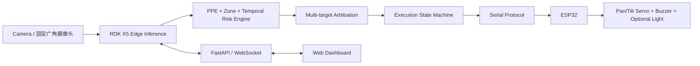

# ARGUS：RDK X5 + ESP32 边缘视觉主动安全干预原型

[English summary](README.md)

ARGUS 是面向 RDK X5 的固定广角视觉研究与工程原型。系统识别人员、安全帽和反光衣，结合危险区域、跨帧 PPE 状态、风险持续时间和目标运动趋势计算风险；多人同时出现时，由仲裁器选择当前最需要干预的目标，再通过执行状态机和串口协议驱动 ESP32。

> **安全声明：ARGUS 是研究与工程原型，不能替代工业安全认证系统、急停装置、机械限位或人工安全管理。**

## 1. 核心能力

- 固定广角摄像头采集，不假设摄像头随目标移动；
- RDK X5 BPU 上的 `person / helmet / reflective_vest` 三类检测；
- 安全帽、反光衣与人员框的空间关联；
- 轻量多目标跟踪与 PPE 跨帧平滑；
- 多危险区、PPE 规则、持续时间、运动趋势和不确定性综合评分；
- 多目标风险仲裁、锁定奖励、切换代价、抢占阈值和短时丢失保持；
- `SEARCH / AIMING / WARNING / RECOVER` 执行状态机；
- RDK X5 到 ESP32 的 `A / T / @T / C / L` 串口协议；
- 双舵机与蜂鸣器控制，协议保留灯光字段；
- FastAPI、WebSocket 和浏览器仪表板；
- 在线网络访问模式与离线本地预览模式。

## 2. 为什么不是简单“检测框跟随舵机”

直接选择最大检测框并驱动舵机，会在多人、遮挡、短时漏检和相邻目标之间频繁跳变。ARGUS 的实际决策链是：

1. 将 helmet/vest 检测框关联到具体 person；
2. 使用跨帧轨迹平滑 PPE 状态，降低单帧误报；
3. 判断人员是否进入危险区、违反该区 PPE 规则；
4. 结合区域等级、持续时间、运动趋势和置信度计算风险；
5. 在多个候选目标之间加入锁定奖励、切换惩罚和旋转距离成本；
6. 只有候选通过确认并进入执行状态机后，才发送方向和报警命令；
7. 目标短时丢失时保持方向但停止延长报警。

因此，检测只是输入；风险判断、仲裁和执行状态控制才决定是否干预。

## 3. 系统架构



## 4. 硬件关系

- 摄像头连接 RDK X5，由板端完成采集、BPU 推理、跟踪、风险判断和 Web 服务；
- RDK X5 通过 USB 串口连接 ESP32，默认 115200 baud；
- ESP32 固件当前验证引脚为：
  - 水平舵机：GPIO25；
  - 俯仰舵机：GPIO26；
  - 蜂鸣器：GPIO27；
- 舵机必须使用独立、满足电流要求的电源，并与 ESP32/RDK 共地；
- 串口协议包含 `light` 字段，但当前公开固件没有绑定已验证的灯光 GPIO。接入灯光前应完成驱动电路、引脚和电气安全验证。

详细接线与供电注意事项见 [HARDWARE_AND_WIRING.md](docs/HARDWARE_AND_WIRING.md)。

## 5. 在线模式与离线模式

| 模式 | 目录 | 用途 |
|---|---|---|
| 在线 | `online/` | 浏览器通过 FastAPI/WebSocket 查看画面、状态、事件和配置 |
| 离线 | `offline/` | 保留本地 OpenCV 预览，适合不依赖远程浏览器的板端调试 |

两种模式共享同一套检测后处理、风险引擎、目标仲裁、状态机和串口协议。主要差异是在线连接统计、网络访问方式和本地预览开关。

默认 `host: 127.0.0.1`。只有在受信任网络中需要远程访问时，才将其显式改为 `0.0.0.0` 或板卡地址。

## 6. 模型格式与后处理

目标模型接口：

```text
输入：1×3×640×640，RDK 运行时为 NV12
类别：person、helmet、reflective_vest
类别数：3
strides：[8, 16, 32]
DFL reg_max：16
输出：6 个张量
分类输出：[0, 2, 4]
回归输出：[1, 3, 5]
```

对应输出形状：

```text
[1,80,80,3]  [1,80,80,64]
[1,40,40,3]  [1,40,40,64]
[1,20,20,3]  [1,20,20,64]
```

后处理顺序为：

```text
分类 sigmoid
→ DFL softmax
→ dist2bbox
→ 映射回原图
→ class-aware NMS
→ PPE 与 person 关联
```

模型文件不进入 Git 历史。当前发现的 `.pt`、`.onnx`、Bayes-E `.bin` 与代码接口匹配，但包含训练/构建机器绝对路径，训练数据的再分发授权也无法确认，因此未放入公开 Release。见 [模型说明](models/README.md)。

## 7. 快速开始

### 7.1 准备配置

```bash
cp configs/runtime.example.yaml configs/runtime.yaml
cp configs/danger_zones.example.json configs/danger_zones.runtime.json
cp configs/servo_calibration.example.json configs/servo_calibration.runtime.json
```

默认安全值：

```yaml
hardware_enabled: false
servo_enabled: false
buzzer_enabled: false
light_enabled: false
llm_bridge_enabled: false
host: 127.0.0.1
port: 8000
```

### 7.2 放置模型

将兼容的 RDK X5 Bayes-E 模型放置为：

```text
models/argus_ppe_dfl_640_rdkx5.bin
```

也可以使用环境变量：

```bash
export ARGUS_MODEL_PATH=/path/to/compatible_model.bin
```

缺少模型时程序会给出明确路径和 `models/README.md` 指引，不会静默忽略。

### 7.3 安装与启动

在 RDK X5 上：

```bash
python3 -m pip install -r requirements.txt
./online/check_system.sh
./online/start.sh
```

本机访问：

```text
http://127.0.0.1:8000
```

离线预览：

```bash
./offline/start.sh
```

## 8. RDK X5 部署

板端需要 Ubuntu 22.04、Python 3.10、BPU Runtime、`hobot_dnn`/`pyeasy_dnn`、`hrt_model_exec`、摄像头驱动以及 Python 运行依赖。`hobot_dnn`、BPU Runtime 和 `hrt_model_exec` 通常由 RDK X5 系统镜像或 D-Robotics 工具提供，不应从普通 PyPI 环境替代安装。

模型检查：

```bash
hrt_model_exec model_info --model_file models/argus_ppe_dfl_640_rdkx5.bin
hrt_model_exec perf --model_file models/argus_ppe_dfl_640_rdkx5.bin
```

完整步骤见 [DEPLOYMENT_RDK_X5.md](docs/DEPLOYMENT_RDK_X5.md)。

## 9. ESP32 烧录与串口协议

固件位置：

```text
firmware/esp32/active_warning_controller/active_warning_controller.ino
```

使用 Arduino IDE 或 `arduino-cli` 选择实际 ESP32 板型后烧录。RDK 侧推荐 `A` 协议，直接发送已标定的 pan/tilt；`T` 发送像素坐标；`@T` 用于旧版归一化坐标兼容。

```text
A,seq,zone_id,pan,tilt,score,light,beep
T,seq,zone_id,cx,cy,img_w,img_h,score,light,beep
@T,seq,valid,xn,yn,danger,alarm
C
L,seq
```

完整字段与示例见 [SERIAL_PROTOCOL.md](docs/SERIAL_PROTOCOL.md)。

## 10. 危险区域与舵机标定

- 危险区域使用 640×360 显示坐标；
- 每个区域配置风险等级、是否启用，以及 helmet/vest 要求；
- 区域文件默认写入 `configs/danger_zones.runtime.json`；
- 舵机使用 3×3 稀疏网格与双线性插值，可添加区域固定角度覆盖；
- 首次标定必须保持 `hardware_enabled: false`，先人工确认角度限位和供电；
- 确认机械限位后，再依次启用 `hardware_enabled` 与 `servo_enabled`。

见 [CALIBRATION.md](docs/CALIBRATION.md)。

## 11. 配置覆盖

运行时读取 `configs/runtime.yaml`。也可设置 `ARGUS_CONFIG` 指向另一个 YAML；单个配置可用环境变量覆盖，例如：

```bash
ARGUS_HOST=127.0.0.1 \
ARGUS_PORT=8000 \
ARGUS_HARDWARE_ENABLED=false \
ARGUS_ESP32_PORT=/dev/ttyUSB0 \
./online/start.sh
```

## 12. 当前限制

- 需要真实 RDK X5 才能验证 BPU 推理；CI 不运行模型或硬件测试；
- macOS 不保证能够执行 X5 INT8 编译；
- 模型训练数据来源和再分发授权需要模型提供方单独确认；
- 当前公开固件只验证双舵机和蜂鸣器，灯光字段尚未绑定已验证 GPIO；
- 摄像头、舵机和危险区的空间关系必须在现场重新标定；
- Web 服务没有面向公网的身份认证，不应直接暴露到互联网；
- 风险分数和阈值属于研究参数，不是安全完整性等级认证结果；
- LLM/ROS 桥接默认关闭，且不参与核心安全决策。

## 13. 项目迭代

- 初始阶段：单危险区、单帧人员检测和 Web 画面；
- PPE 阶段：加入 helmet/reflective_vest 与 person 空间关联；
- 时序阶段：加入轻量跟踪、PPE 平滑、持续风险和事件日志；
- 仲裁阶段：加入多人竞争、目标锁定、抢占和丢失保持；
- 执行阶段：加入状态机、舵机标定和 ESP32 多协议兼容；
- 公开版本：拆分在线/离线模式，集中安全配置，补齐模型、部署、接线和限制说明。

版本记录见 [CHANGELOG.md](CHANGELOG.md)。

## 14. 开源协议与贡献

代码和文档使用 [MIT License](LICENSE)。模型、Ultralytics、D-Robotics 工具链、RDK 系统组件和前端第三方库分别遵循其自身许可。

提交问题或改进前请阅读 [CONTRIBUTING.md](CONTRIBUTING.md)。涉及实际执行器时，贡献必须保持“默认禁用硬件”原则，并说明测试环境、供电、限位和回退方法。
