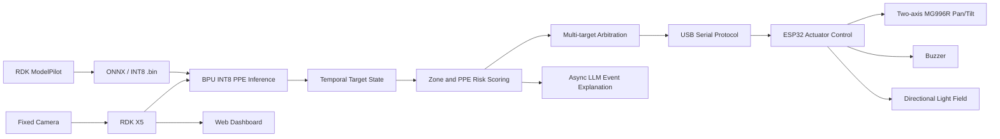

# Digua Robotics Embedded Contest RDK X5 Track Repository

Self-trained visual active safety intervention system with dual-mode low-load LLM inference based on RDK X5

[中文说明](README.md) | [RDK ModelPilot](tools/rdk-modelpilot/README.md)

> This repository is a contest and research prototype. It is not a certified industrial safety system and must not replace emergency stops, safety interlocks, physical guards, or trained human supervision.

## Project Overview

This repository contains an RDK X5 based active safety prototype for labs, construction-like areas, and equipment operation spaces. A fixed camera captures the scene. A self-trained PPE detector runs on the RDK X5 BPU and recognizes `person`, `helmet`, and `reflective_vest`. The system combines danger-zone rules, PPE state, dwell time, motion tendency, and detection confidence to rank risk.

When a risk event is confirmed, the RDK X5 sends commands to an ESP32 over USB serial. The ESP32 drives a two-axis MG996R pan/tilt unit, a buzzer, and a reserved light-control field. The online mode provides a web dashboard, logs, and asynchronous LLM event explanations. The offline mode keeps the local autonomous pipeline available for board-side debugging and lower-load operation.

The repository also includes **RDK ModelPilot** under `tools/rdk-modelpilot/`. It is a Windows-side deployment helper for checking the conversion environment, exporting `.pt` models to ONNX, validating the RDK X5 YOLO DFL six-output structure, building Bayes-E INT8 `.bin` models with OpenExplorer, and generating deployment reports. The original [AIM135D/rdk-modelpilot](https://github.com/AIM135D/rdk-modelpilot) repository remains independent and is not removed or overwritten.

## What Is Included

- RDK X5 online runtime under `online/`.
- RDK X5 offline runtime under `offline/`.
- ESP32 actuator firmware under `firmware/`.
- Runtime configuration examples under `configs/`.
- Model placement guide, model card, and release manifest under `models/`.
- Deployment, wiring, protocol, calibration, training, and safety documents under `docs/`.
- Windows-side RDK ModelPilot tool under `tools/rdk-modelpilot/`.
- Hardware-free basic tests under `tests/`.

## System Architecture



## Documentation Index

- [System overview](docs/system_overview.md)
- [RDK X5 deployment](docs/DEPLOYMENT_RDK_X5.md)
- [Model pipeline](docs/MODEL_PIPELINE.md)
- [Training, active learning, and mapping notes](docs/TRAINING_ACTIVE_LEARNING_AND_MAPPING.md)
- [RDK ModelPilot integration](docs/modelpilot_integration.md)
- [Hardware and wiring](docs/HARDWARE_AND_WIRING.md)
- [Serial protocol](docs/SERIAL_PROTOCOL.md)
- [Calibration](docs/CALIBRATION.md)
- [Safety and limitations](docs/SAFETY_AND_LIMITATIONS.md)

## Key Features

- Self-trained three-class PPE detection: `person`, `helmet`, `reflective_vest`.
- RDK X5 BPU deployment with 640×640 input, NV12 runtime input, YOLO DFL six-output post-processing, and Bayes-E INT8 `.bin` model.
- Configurable danger zones with per-zone risk level and PPE requirements.
- Temporal target state, PPE smoothing, risk scoring, target locking, switch cost, and short-loss hold.
- ESP32 serial actuator loop with pan/tilt servo control, buzzer control, light field, and ACK feedback.
- Online web dashboard and offline local mode.
- Asynchronous, degradable LLM event explanation that does not block the real-time detection and actuator path.
- Integrated RDK ModelPilot tool for Windows-side model conversion and deployment report generation.

## Hardware Components

- RDK X5.
- Fixed wide-angle camera or USB camera.
- ESP32-E / ESP-WROOM-32E development board.
- Two MG996R servos.
- Buzzer.
- Directional light or reserved light actuator.
- Custom PCB or equivalent wiring board.
- 12 V power adapter.
- Independent 6 V servo power supply.
- USB serial connection between RDK X5 and ESP32.
- Common ground between modules.

Power, current capacity, grounding, wiring, and mechanical limits must be checked on the actual hardware before enabling actuator output.

## Model Contract

Class order:

```text
0 person
1 helmet
2 reflective_vest
```

Runtime contract:

- Input size: 640×640.
- Runtime input: NV12.
- Detection head: YOLO DFL six outputs.
- Strides: 8, 16, 32.
- DFL `reg_max`: 16.
- Classification outputs: `[0, 2, 4]`.
- Box regression outputs: `[1, 3, 5]`.
- Post-processing: sigmoid, DFL softmax, dist2bbox, class-aware NMS, and PPE-to-person association.

The default model path is:

```text
models/argus_ppe_dfl_640_rdkx5.bin
```

Model binaries are not stored in Git history. Authorized `.pt`, `.onnx`, and Bayes-E `.bin` artifacts matching this interface are published in the [v1.0.0 release](https://github.com/AIM135D/argus-rdk-x5/releases/tag/v1.0.0). See [models/README.md](models/README.md) and [models/model_manifest.json](models/model_manifest.json) for filenames and checksums.

## RDK X5 Runtime Environment

The runtime depends on the actual RDK X5 image and BPU stack. The current code expects:

- Ubuntu 22.04 or an official RDK X5 system environment.
- Python 3.
- RDK X5 BPU Runtime.
- `hobot_dnn` / `pyeasy_dnn`.
- `hrt_model_exec`.
- OpenCV.
- NumPy and SciPy.
- FastAPI, Uvicorn, and WebSocket support.
- PyYAML.
- pyserial.

Install Python dependencies:

```bash
python3 -m pip install -r requirements.txt
```

`hobot_dnn`, `pyeasy_dnn`, the BPU runtime, and `hrt_model_exec` are normally provided by the RDK X5 system image or D-Robotics toolchain and should not be replaced by unrelated PyPI packages.

## Quick Start

Prepare runtime files:

```bash
cp configs/runtime.example.yaml configs/runtime.yaml
cp configs/danger_zones.example.json configs/danger_zones.runtime.json
cp configs/servo_calibration.example.json configs/servo_calibration.runtime.json
```

Install dependencies and run a system check:

```bash
python3 -m pip install -r requirements.txt
./online/check_system.sh
```

If ESP32 output is enabled, check serial permissions:

```bash
chmod 666 /dev/ttyUSB0
```

Start online mode:

```bash
./online/start.sh
```

Default URL:

```text
http://127.0.0.1:8000
```

To access the dashboard from another trusted host, change `host` in `configs/runtime.yaml` from `127.0.0.1` to the board address or `0.0.0.0`. Camera index, model path, serial port, and web port should be adjusted for the actual setup.

## Online Mode

`online/` provides the browser-facing mode:

- Live video and detection overlays.
- Danger-zone and PPE state.
- Risk score, arbitration state, and actuator state.
- ESP32 serial status, last command, and ACK.
- Runtime metrics and event logs.
- Asynchronous LLM suggestions.

The core pipeline does not require the browser to stay open. The dashboard is mainly for configuration, observation, and logging.

## Offline Mode

`offline/` keeps a local autonomous path for debugging:

```bash
./offline/start.sh
```

It keeps camera capture, BPU inference, risk reasoning, arbitration, and ESP32 actuator control available when remote browser access is unnecessary or unstable.

## ESP32 Firmware

Firmware location:

```text
firmware/esp32/active_warning_controller/active_warning_controller.ino
```

Use Arduino IDE or PlatformIO to flash the firmware. The public firmware has been validated with:

- Pan servo: GPIO25.
- Tilt servo: GPIO26.
- Buzzer: GPIO27.

The RDK side defaults to `/dev/ttyUSB0`, 115200 baud, and protocol `A`. Check servo GPIO, buzzer GPIO, light GPIO, baud rate, and protocol before running the actuator loop. See [docs/SERIAL_PROTOCOL.md](docs/SERIAL_PROTOCOL.md) for protocol details.

## RDK ModelPilot Tool

RDK ModelPilot is included under:

```text
tools/rdk-modelpilot/
```

It is a Windows-side helper for model deployment. It does not replace RDK Studio and is not a board flashing tool, generic IDE, training platform, or annotation tool. Its role is to make the self-trained YOLO to RDK X5 deployment path easier to reproduce:

Windows installer and portable package:

```text
https://github.com/AIM135D/rdk-modelpilot/releases/tag/v0.1.0
```

The main contest repository keeps a source-code copy for review and reproducibility. The downloadable Windows builds remain published through the independent tool repository release page.

```text
.pt
→ D-Robotics export_monkey_patch.py
→ ONNX
→ ONNX six-output DFL validation
→ OpenExplorer hb_mapper checker / makertbin
→ Bayes-E INT8 .bin
→ deploy_config.py and deploy_report.md
```

Backend:

```powershell
cd tools\rdk-modelpilot
python -m pip install -r backend\requirements.txt
python backend\main.py
```

Frontend:

```powershell
cd tools\rdk-modelpilot
npm --prefix frontend install
npm --prefix frontend run electron:dev
```

See [tools/rdk-modelpilot/README.md](tools/rdk-modelpilot/README.md) and [docs/modelpilot_integration.md](docs/modelpilot_integration.md) for details.

## Model Conversion Notes

If you only want to run the current system, use the released RDK X5 `.bin` model. If you need to train and deploy a replacement model, use `tools/rdk-modelpilot/` or the official D-Robotics `rdk_model_zoo` flow:

```text
.pt
→ ONNX
→ hb_mapper checker
→ hb_mapper makertbin
→ .bin
```

Do not treat a generic Ultralytics `model.export()` ONNX as the final deployment model. The board-side post-processing expects the RDK X5 YOLO DFL six-output layout.

## FAQ

1. Camera cannot open.
   Check `camera_index`, USB permissions, and whether another process is using the camera.

2. `/dev/ttyUSB0` permission is denied.
   Use `chmod 666 /dev/ttyUSB0` for temporary debugging, or configure a proper user group or udev rule.

3. ESP32 does not respond.
   Check the serial port, baud rate, USB cable, flashed firmware, and protocol setting.

4. Servos do not move.
   Confirm `hardware_enabled` and `servo_enabled`, independent servo power, common ground, and GPIO mapping.

5. Web dashboard cannot open.
   Check that online mode is running and that `host` / `port` match the access path.

6. Model path is wrong.
   Use `models/argus_ppe_dfl_640_rdkx5.bin`, update `configs/runtime.yaml`, or set `ARGUS_MODEL_PATH`.

7. No detections appear.
   Check model information with `hrt_model_exec`, class order, threshold values, and the six-output contract.

8. ModelPilot environment check fails.
   Follow the missing items reported by the tool. WSL, Docker, Conda, OpenExplorer, and `rdk_model_zoo` are separate layers.

9. Docker image cannot be pulled.
   Check Docker Desktop, proxy/network settings, and the configured OpenExplorer image name.

10. ONNX is not six-output.
    Recheck the export path and prefer the D-Robotics `export_monkey_patch.py` workflow.

## Safety Notice

This is a contest prototype and learning-oriented engineering project. It must not replace certified industrial safety systems, emergency stops, physical guards, safety interlocks, or human supervision. Test actuator behavior in a low-risk environment first, and verify power supply, current capacity, wiring, mechanical limits, and personnel safety before enabling real output.

## License and Third-party Notice

Repository code and documentation are released under the [MIT License](LICENSE). Model artifacts, D-Robotics tooling, RDK system components, Ultralytics, Electron, React, FastAPI, and other third-party dependencies retain their own licenses.
