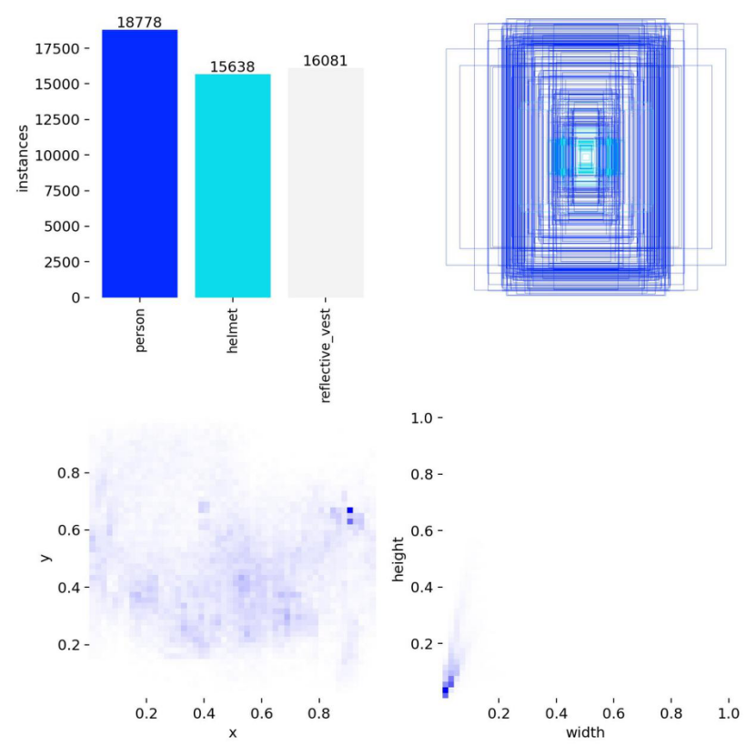
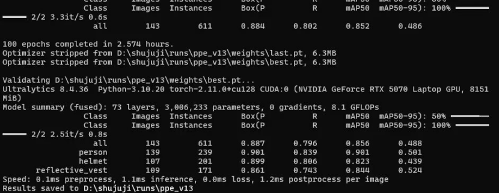
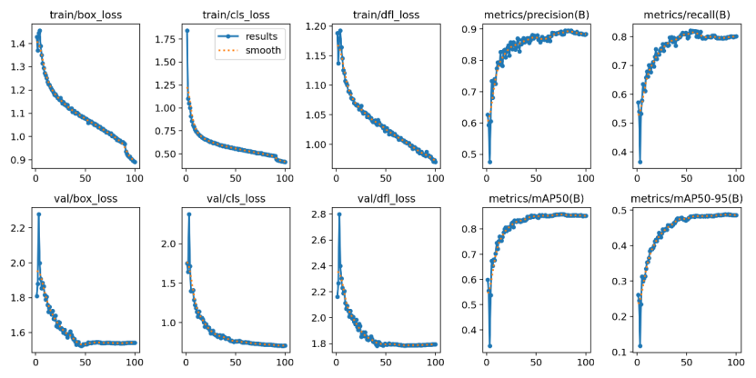
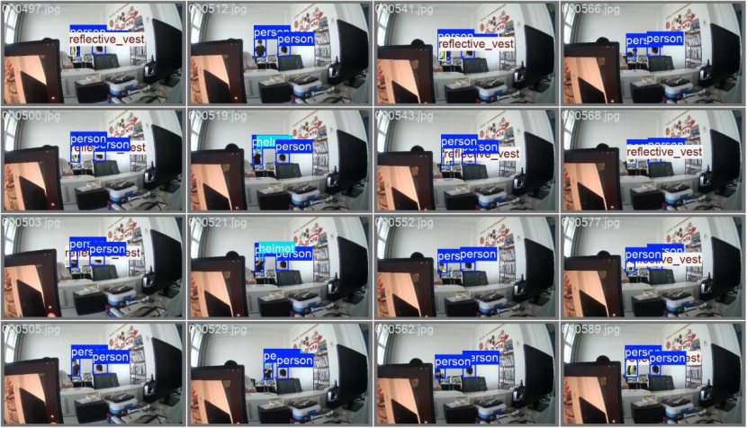
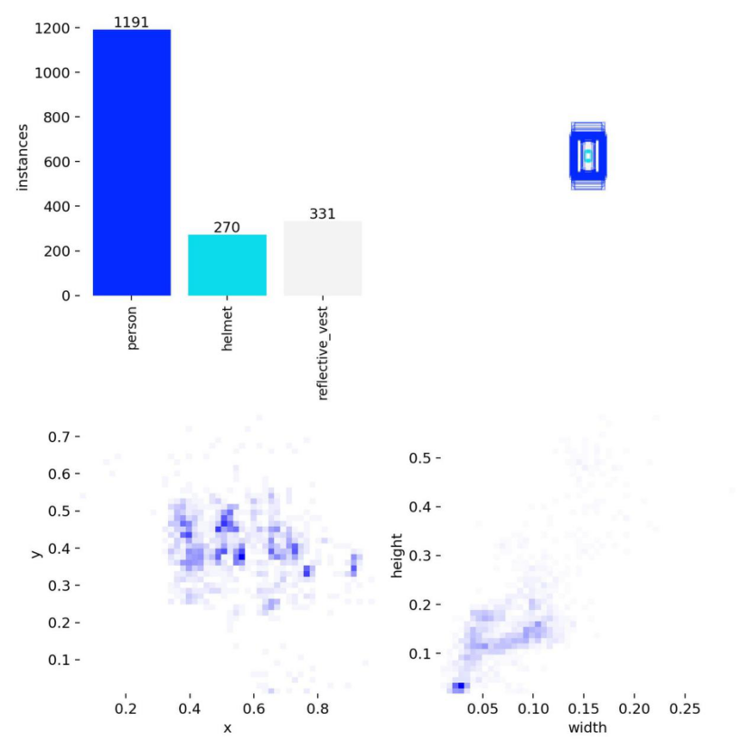
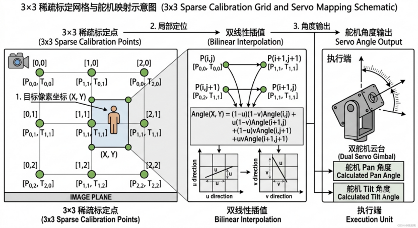

# 深度学习训练、主动学习与舵机映射说明

本文补充记录当前 PPE 检测模型从第一代训练、主动学习补样到舵机映射标定的关键依据。图中指标来自项目训练与调试过程截图，主要用于说明工程迭代思路，不作为工业安全认证指标。

## 1. 第一代深度学习模型

第一代模型围绕 `person`、`helmet`、`reflective_vest` 三类目标训练。数据分布如下图所示：`person` 约 18778 个实例，`helmet` 约 15638 个实例，`reflective_vest` 约 16081 个实例。右上角和下方热力图反映了标注框在画面中的空间分布和目标尺寸分布，可以看出样本主要集中在固定广角摄像头视野中心和中下区域。



训练日志截图显示，该批次训练完成 100 个 epoch，模型规模约 73 层、3006233 个参数、8.1 GFLOPs。验证集整体指标约为 `Precision=0.887`、`Recall=0.796`、`mAP50=0.856`、`mAP50-95=0.488`。按类别看，`person` 检测最稳定，`helmet` 和 `reflective_vest` 会受到遮挡、距离、反光和小目标尺寸影响。



训练曲线中，box、cls、DFL loss 在前期快速下降，后期逐步收敛；Precision、Recall 和 mAP 曲线在 50 个 epoch 后趋于平稳。这说明模型已经学到主要场景特征，但对远距离小目标、遮挡目标和 PPE 边界不清晰样本仍有继续补样价值。



## 2. 主动学习补样

主动学习阶段不再盲目扩大数据集，而是优先挑选模型容易不稳定的样本，例如：

- 固定摄像头下远距离人员、小安全帽、小反光衣；
- 显示器、桌面设备和背景文字造成的误检场景；
- PPE 与 person 框重叠不充分的场景；
- 反光、遮挡、姿态变化导致置信度波动的场景；
- 线上推理中出现漏检、错检或类别混淆的帧。

下图展示了一批主动学习样本的推理与标注效果。它们来自更接近实际部署视角的固定机位画面，能帮助模型补充真实运行中经常出现的小目标、遮挡和复杂背景。



主动学习批次中，样本实例分布为：`person` 1191、`helmet` 270、`reflective_vest` 331。与第一代全量数据相比，该批次规模更小，但更贴近项目部署场景。它的作用不是替代基础数据集，而是用于增强模型在实际摄像头位置、实际光照和实际目标尺度下的稳定性。



## 3. 映射图像与舵机标定

视觉目标到舵机角度的转换采用 3×3 稀疏标定点和双线性插值。标定时先在图像平面选择 9 个点，每个点记录对应的 pan/tilt 舵机角度；运行时根据目标中心点 `(X, Y)` 所在网格，取周围四个标定点进行插值，计算最终舵机角度。



这种方式比直接用线性比例把像素坐标映射到角度更稳，因为固定广角摄像头存在视角畸变，舵机结构也可能存在非线性误差。3×3 标定可以在不引入复杂相机标定流程的情况下，快速建立“图像位置 → 云台角度”的工程映射。

实际部署时需要注意：

- 标定前先关闭自动执行，只观察目标中心点和预测角度；
- 标定点应覆盖常见危险区域，而不是只覆盖画面中心；
- 每次移动摄像头、云台或支架后，都需要重新标定；
- 舵机角度必须保留机械限位余量，避免撞限位或拉扯线缆；
- 映射只负责瞄准方向，是否报警仍由风险引擎和执行状态机决定。

## 4. 与系统闭环的关系

深度学习模型提供目标检测输入，主动学习提升模型对真实部署场景的适应性，舵机映射负责把视觉目标转换成执行机构角度。三者在系统中的关系如下：

```text
训练数据 / 主动学习样本
→ YOLO PPE 检测模型
→ RDK X5 BPU 推理
→ person / helmet / reflective_vest 后处理
→ PPE 合规判断与风险评分
→ 目标仲裁
→ 图像坐标到 pan/tilt 映射
→ ESP32 控制双轴舵机、蜂鸣器和灯光字段
```

因此，本项目不是单纯展示检测框，而是把模型训练、边缘推理、风险判断、目标选择和执行机构控制连成一个可复现的闭环。
